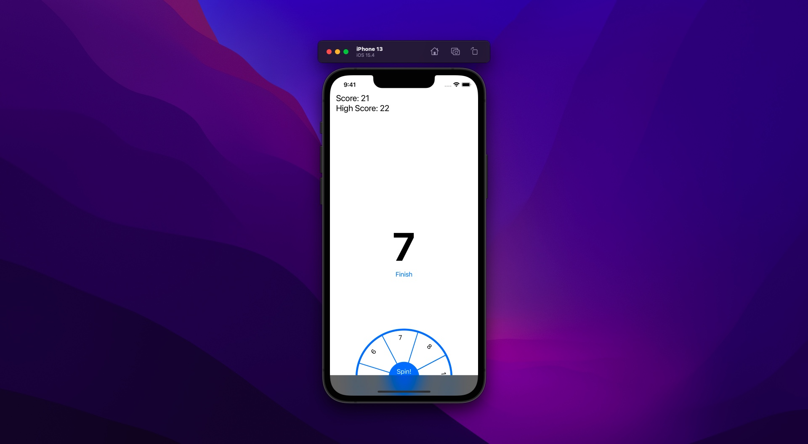

# Spin the Wheel

A spin the wheel game made in SwiftUI

## Concept

Click on the _Spin_ button to spin the wheel and add the obtained number to your score, however if you obtain a 1 you lose the game and your score ends up at 0.

The user can finish the game on their own at any point to keep their current score.

## Features

- Permamently saving the user's high score
- Animated UI

